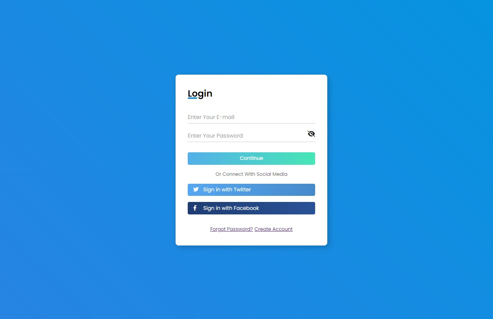

# Login Page

Esta página está disponível no [Github Pages](https://gabrielgustavoms.github.io/loginpage0/) e foi inspirada em um tutorial do canal [Girl Coding](https://www.youtube.com/c/GirlCoding), no YouTube. Eu realizei melhorias, adicionando variáveis ao css para controlar a tonalidade das cores, um botão para visualizar ou ocultar os campos de senha, alterações na responsividade e algumas outras modificações. Eu também criei outras paginas: "Create Account" e "Forgot Password?"

---

This page is avaliable on [Github Pages](https://gabrielgustavoms.github.io/loginpage0/) and it was inspired by a tutorial from the [Girl Coding](https://www.youtube.com/c/GirlCoding) YouTube channel. I made improvements, adding variables to css to control color tone, a button to show or hide password fields, improvements in responsiveness and some other modifications. I also created other pages: "Create Account" and "Forgot Password?"

---

**Tecnologias: | Technologies:**
* HTML
* CSS
* JavaScript
* Font Awesome
* Google Fonts
